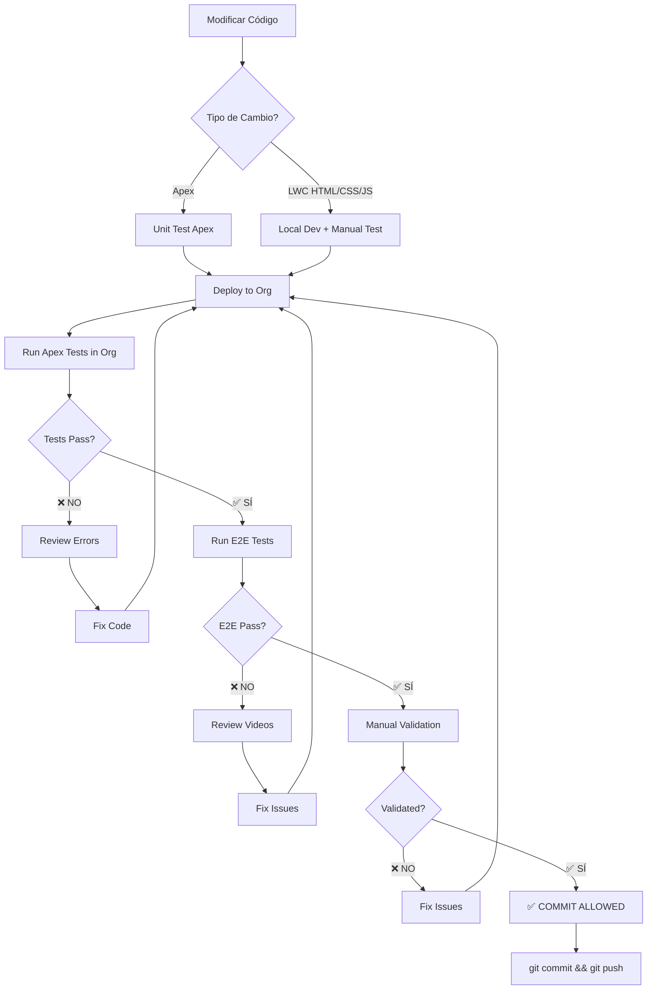
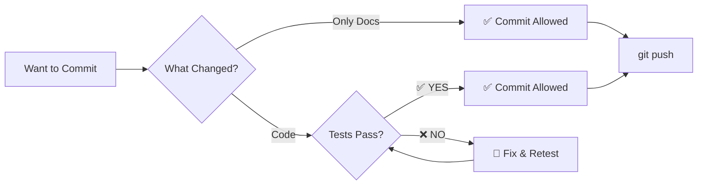

# 🚫 Reglas de Commits

## Regla de Oro

**NADA se commitea hasta que TODAS las pruebas pasen.**

---

## ✅ Excepciones: Solo Documentación

**Se permite commitear documentación sin que pasen tests**, siempre que:

1. **Solo** se modifiquen archivos de documentación:
   - `*.md` (cualquier Markdown)
   - `docs/**/*` (carpeta docs completa)
   - `README.md`
   - `CHANGELOG.md`
   - etc.

2. **NO** se toquen estos paths:
   - ❌ `force-app/`
   - ❌ `tests/e2e/`
   - ❌ `tests/unit/`
   - ❌ `.github/workflows/` (excepto docs)

### Ejemplo de Commit Válido (Solo Docs)

```bash
# Estos archivos son OK para commit sin tests:
git add README.md
git add DEVELOPMENT_APPROACH.md
git add docs/APEX_DEVELOPMENT_FLOW.md
git add CHANGELOG.md

git commit -m "docs: Update development workflow"
git push
```

### Ejemplo de Commit INVÁLIDO

```bash
# ❌ Este commit incluye código Y docs
git add force-app/main/default/lwc/jtQueryViewer/jtQueryViewer.js
git add README.md

# ❌ NO SE PUEDE COMMITEAR sin tests passing
git commit -m "fix: binding issue"
# → BLOQUEADO por regla
```

---

## 🚨 Cambios en Código: Flujo Obligatorio

Si tu commit incluye **cualquier cambio** en:
- `force-app/` (Apex, LWC, metadata)
- `tests/` (test files)
- `.github/workflows/` (CI/CD)

**DEBES completar TODO el flujo:**



---

## 📋 Checklist Pre-Commit (Código)

Antes de commitear código, verifica:

- [ ] ✅ **Unit Tests Apex**: Todos pasan en org
- [ ] ✅ **E2E Tests**: 14/14 pasan
- [ ] ✅ **E2E Videos**: Revisados, UI se ve bien
- [ ] ✅ **Manual Test**: Validado en org target
- [ ] ✅ **Console**: Sin errores JavaScript
- [ ] ✅ **Linter**: Sin warnings críticos
- [ ] ✅ **Prettier**: Código formateado
- [ ] ✅ **YAML Lint**: Archivos YAML válidos

### Comandos de Validación

```bash
# 1. Deploy
sf project deploy start --target-org <alias>

# 2. Apex Tests
sf apex run test --test-level RunLocalTests --result-format human

# 3. E2E Tests
npm run test:e2e

# 4. Review Videos
open test-results/

# 5. Manual Test
# → Login to org
# → Test scenario
# → Check console (F12)

# 6. Pre-commit Hook (automático)
git commit  # → Runs prettier + lint
```

---

## 🎯 Casos de Uso

### Caso 1: Solo Actualizar README

```bash
# ✅ VÁLIDO: Solo docs
git add README.md
git commit -m "docs: Update installation steps"
git push
# → No requiere tests ✓
```

### Caso 2: Fix en Apex

```bash
# ❌ INVÁLIDO sin tests
git add force-app/main/default/classes/JT_QueryViewerController.cls
git commit  # → BLOQUEADO

# ✅ VÁLIDO: Con flujo completo
# 1. Update Apex
# 2. Update Test
# 3. Deploy
sf project deploy start
# 4. Run Apex Tests
sf apex run test --test-level RunLocalTests
# → ALL PASS ✓
# 5. Run E2E
npm run test:e2e
# → 14/14 PASS ✓
# 6. Manual Test
# → VALIDATED ✓
# 7. NOW commit is allowed
git add force-app/
git commit -m "fix: binding issue"
git push
```

### Caso 3: LWC Styling

```bash
# ❌ INVÁLIDO sin tests
git add force-app/main/default/lwc/jtQueryViewer/jtQueryViewer.css
git commit  # → BLOQUEADO

# ✅ VÁLIDO: Con Local Dev + E2E
# 1. Local Dev: Preview changes
sf lightning local dev server start
# 2. Visual validation
# 3. Deploy
sf project deploy start
# 4. Apex Tests (may not change, but run anyway)
sf apex run test --test-level RunLocalTests
# 5. E2E Tests
npm run test:e2e
# 6. Review videos for styling
open test-results/
# → All good ✓
# 7. Commit
git add force-app/main/default/lwc/
git commit -m "style: improve dropdown visibility"
git push
```

### Caso 4: Docs + Code (Mixed)

```bash
# ❌ NO puedes commitear parcialmente
git add README.md
git add force-app/main/default/classes/Controller.cls

# Opción A: Commit docs primero
git add README.md
git commit -m "docs: Update API documentation"
git push

# Luego sigue flujo para código
git add force-app/
# ... run tests ...
git commit -m "feat: Add new API method"
git push

# Opción B: Commit todo junto (después de tests)
# ... run all tests ...
git add -A
git commit -m "feat: Add API method with docs"
git push
```

---

## 🔧 Husky Pre-Commit Hook

El hook de Husky ejecuta automáticamente:

```bash
# .husky/pre-commit
npm run precommit

# package.json → precommit script:
"precommit": "npm run prettier && npm run lint:staged && npm run yamllint"
```

**Qué valida:**
1. **Prettier**: Formato de código
2. **Linter**: Calidad de código (Apex, LWC)
3. **YAML Lint**: Sintaxis de YAMLs

**Qué NO valida (debes hacerlo manualmente):**
- ❌ Apex Tests (requiere org)
- ❌ E2E Tests (requiere deployed code)
- ❌ Manual Testing

---

## 💡 Filosofía

### Por qué esta regla?

1. **Integridad del Código**
   - Los tests garantizan que el código funciona
   - No rompes funcionalidad existente
   - Otros desarrolladores pueden confiar en main

2. **Error-Driven Development**
   - Los errores te guían al fix correcto
   - No adivinas, validas con tests

3. **Documentación != Código**
   - Docs no pueden romper la app
   - Docs mejoran comunicación
   - Docs pueden actualizarse continuamente

---

## 🚦 Resumen



**Simple:**
- 📄 **Docs only?** → Commit sin tests
- 💻 **Code changed?** → MUST pass ALL tests
- 🚫 **Tests fail?** → NO COMMIT until fixed

---

## 📚 Referencias

- [Apex Development Flow](.github/APEX_DEVELOPMENT_FLOW.md)
- [Development Approach](DEVELOPMENT_APPROACH.md)
- [Deploy and Test](.github/DEPLOY_AND_TEST.md)
- [E2E Visual Validation](.github/E2E_VISUAL_VALIDATION.md)

**Recuerda: Tests primero, commits después!** 🚀

