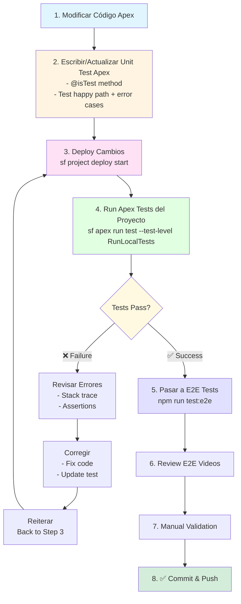

# 🎯 Development Approach - JT Dynamic Queries (Salesforce Adapted)

## Methodology Overview

This Salesforce project follows a **hybrid development methodology** combining:

1. **BDD (Behavior Driven Development)** - Scenarios describe user behavior
2. **Error Driven Development (EDD)** - Errors guide implementation
3. **TDD (Test Driven Development)** - Tests first, then code

Inspired by: [smart-deployment](https://github.com/jterrats/smart-deployment) (adapted for Salesforce)

---

## 🔄 Development Cycle (Salesforce Edition)

### 1. **BDD: Define Behavior**

```gherkin
Feature: Query Data Preview
  As a Salesforce admin
  I want to see a preview of query results
  So that I can verify the query before executing

  Scenario: Preview shows max 5 records with pagination
    Given I have selected a configuration with "Test Record"
    When the preview loads automatically
    Then I should see at most 5 records total
    And the preview should display 3 records per page
    And pagination controls should be visible if > 3 records
```

### 2. **TDD: Write E2E Test First (Playwright)**

```javascript
test('should show data preview after config selection', async ({ page }) => {
  // Arrange
  await navigateToQueryViewer(page);
  const combobox = page.locator('[data-testid="config-selector"]');

  // Act
  await combobox.click();
  await combobox.locator('li[role="option"]').first().click();
  await page.waitForTimeout(2000);

  // Assert
  const previewTable = page.locator('[data-testid="query-preview-table"]');
  await expect(previewTable).toBeVisible();
});
```

### 3. **EDD: Let Errors Guide Implementation**

**Real Example from Today's Session:**

```
❌ Error 1: "Key 'searchName' does not exist in the bindMap"
   👉 Action: Check handleExecuteQuery() - parameter not being passed
   🔧 Fix: Add console.log to debug parameterValues

❌ Error 2: "Locator '[data-testid="query-preview-table"]' not found"
   👉 Action: Add data-testid to lightning-datatable
   🔧 Fix: Add data-testid="query-preview-table" to HTML

❌ Error 3: "executeQueryPreview is not a function"
   👉 Action: Import from Apex controller
   🔧 Fix: import executeQueryPreview from "@salesforce/apex/..."

❌ Error 4: "Method does not exist: executeQueryPreview"
   👉 Action: Create Apex method
   🔧 Fix: Add @AuraEnabled method in JT_QueryViewerController.cls

❌ Error 5: "Toast notifications not dismissing"
   👉 Action: Check ShowToastEvent configuration
   🔧 Fix: Add mode: 'dismissable' to all toasts

✅ All tests pass!
```

---

## 📋 Workflow: Real Bug Fix Example (From Today)

### Bug Report
> **Bug #1:** Toasts don't disappear automatically
> **Bug #2:** Query preview shows only SOQL text, not actual data
> **Bug #3:** Parameter 'searchName' error when executing query

### Step 1: Write E2E Test (BDD Approach)

```javascript
// Test for Bug #1
test('toast should auto-dismiss after 5 seconds', async ({ page }) => {
  await page.click('[data-testid="execute-button"]');
  const toast = page.locator('.slds-notify');
  await expect(toast).toBeVisible();
  await page.waitForTimeout(6000);
  await expect(toast).not.toBeVisible(); // ❌ Fails here
});

// Test for Bug #2
test('should display data preview table with records', async ({ page }) => {
  await selectConfig(page, 'Test Record');
  await page.waitForTimeout(2000);

  const previewTable = page.locator('[data-testid="query-preview-table"]');
  await expect(previewTable).toBeVisible(); // ❌ Fails here
});
```

### Step 2: Run Tests → Get Errors (EDD)

```bash
# Run E2E tests
npm run test:e2e

# Output:
❌ Error: Toast still visible after 6 seconds
❌ Error: Locator not found: [data-testid="query-preview-table"]
```

### Step 3: Fix Based on Errors (One at a time)

#### Fix #1: Toast Dismissal
```javascript
// ❌ Before (Error: mode not set)
showSuccessToast(message) {
  this.dispatchEvent(
    new ShowToastEvent({
      title: "Success",
      message: message,
      variant: "success"
    })
  );
}

// ✅ After (Error told us mode was missing)
showSuccessToast(message) {
  this.dispatchEvent(
    new ShowToastEvent({
      title: "Success",
      message: message,
      variant: "success",
      mode: "dismissable"  // ← EDD: Error guided this fix
    })
  );
}
```

#### Fix #2: Data Preview

**Error-Driven Steps:**

1. **Error:** `data-testid not found`
   **Fix:** Add to HTML template

2. **Error:** `Cannot read property 'previewData' of undefined`
   **Fix:** Initialize `@track queryPreviewData = []`

3. **Error:** `executeQueryPreview is not a function`
   **Fix:** Import from Apex

4. **Error:** `Method does not exist`
   **Fix:** Create Apex method with `@AuraEnabled`

5. **Error:** `List has no rows`
   **Fix:** Add `LIMIT 1` to config query

### Step 4: Commit with Context

```bash
git commit -m "fix(toasts): Add auto-dismiss mode

🐛 Bug #1: Toasts not disappearing
✅ Test: Added E2E test for auto-dismiss behavior
🔧 Fix: Added mode: 'dismissable' to ShowToastEvent

Error-Driven: Test revealed missing mode parameter
BDD Scenario: Toast auto-dismisses after 5 seconds ✓

Affected methods:
- showSuccessToast()
- showErrorToast()
- showInfoToast()
- showWarningToast()"
```

---

## 🎯 Key Principles (Salesforce-Specific)

### 1. **Salesforce Test Pyramid**

```
           E2E Tests (Playwright)
           ├─ User Flows
           ├─ Integration Points
           └─ UI Interactions
                    ↓
        Apex Unit Tests (@isTest)
        ├─ Controllers
        ├─ Services
        └─ Utilities
                    ↓
          LWC Jest Tests
          ├─ Component Logic
          ├─ Computed Properties
          └─ Event Handlers
```

### 2. **Error-Driven Development in Salesforce**

**Salesforce-specific errors guide you:**

```javascript
// Error: "Invalid bind variable: paramName"
// → Fix: Ensure parameterValues includes paramName

// Error: "Method is not visible: @AuraEnabled"
// → Fix: Add @AuraEnabled to Apex method

// Error: "System.LimitException: Too many SOQL queries"
// → Fix: Use @wire or cacheable=true

// Error: "Read timed out"
// → Fix: Use @future or queueable Apex

// Error: "Maximum view state size limit (170KB) exceeded"
// → Fix: Remove unnecessary @track decorators
```

### 3. **BDD Scenarios for Salesforce Features**

```gherkin
Feature: Dynamic Query Execution
  Background:
    Given I am logged into Salesforce as an admin
    And I navigate to the Query Viewer app

  Scenario: Execute query with parameters
    Given I have selected configuration "Test Record"
    And the query requires parameter "searchName"
    When I enter "Jaime" in the "searchName" field
    And I click "Execute Query"
    Then I should see results in the table
    And the results should show records matching "Jaime"

  Scenario: Query preview loads automatically
    Given I have selected configuration "All Active Accounts"
    Then the query preview should load automatically
    And I should see max 5 records in preview
    And pagination should show if > 3 records
```

---

## 🔧 Salesforce-Specific Testing Practices

### Apex Tests (Unit + Integration)

```apex
@isTest
static void testExecuteQueryPreview() {
  // Arrange
  String devName = 'Test_Record';
  String bindings = '{"name": "Test"}';

  // Act
  Test.startTest();
  JT_QueryViewerController.QueryResult result =
    JT_QueryViewerController.executeQueryPreview(devName, bindings);
  Test.stopTest();

  // Assert
  System.assertEquals(true, result.success, 'Preview should succeed');
  System.assert(result.recordCount <= 5, 'Max 5 records');
  System.assertNotEquals(null, result.fields, 'Fields should be populated');
}
```

**EDD in Apex:**

```apex
// ❌ Error: "List has no rows for assignment"
// 👉 Add LIMIT 1

// ❌ Error: "System.QueryException: Expecting value: line 1"
// 👉 Add null check for bindingsJson

// ❌ Error: "Method does not exist: queryWithBinds"
// 👉 Use Database.queryWithBinds() not Database.query()
```

### LWC E2E Tests (Playwright)

```javascript
test('should paginate preview data', async ({ page }) => {
  // Arrange
  await selectConfig(page, 'All Active');
  await page.waitForTimeout(2000);

  // Act
  const nextButton = page.locator('[data-testid="preview-next-button"]');
  await nextButton.click();

  // Assert
  const pageInfo = page.locator('[data-testid="preview-page-info"]');
  await expect(pageInfo).toContainText('Page 2 of');
});
```

### LWC Jest Tests (Unit)

```javascript
describe('jtQueryViewer', () => {
  it('should initialize with empty preview data', () => {
    const element = createElement('c-jt-query-viewer', {
      is: JtQueryViewer
    });
    document.body.appendChild(element);

    expect(element.queryPreviewData).toEqual([]);
    expect(element.showPreviewData).toBe(false);
  });
});
```

---

## 📊 Real Example: Today's Implementation

### Feature Request
> "Add data preview to show actual query results (not just SOQL text)"

### BDD Scenario
```gherkin
Scenario: Preview shows query data
  Given I select "Test Record" configuration
  When the preview loads
  Then I should see a data table
  And the table should have max 5 records
  And pagination should work for > 3 records
```

### Error-Driven Implementation Flow

#### Step 1: Write E2E Test
```javascript
test('should show data preview table', async ({ page }) => {
  const table = page.locator('[data-testid="query-preview-table"]');
  await expect(table).toBeVisible();
});
```

**Result:** ❌ `Error: Locator not found`

#### Step 2: Add HTML Element
```html
<lightning-datatable
  data-testid="query-preview-table"
  key-field="Id"
  data={previewPaginatedData}
  columns={previewColumns}
></lightning-datatable>
```

**Result:** ❌ `Error: Cannot read property 'previewPaginatedData'`

#### Step 3: Add LWC Properties
```javascript
@track queryPreviewData = [];
@track previewColumns = [];
@track showPreviewData = false;

get previewPaginatedData() {
  const start = (this.previewCurrentPage - 1) * this.previewPageSize;
  return this.queryPreviewData.slice(start, start + this.previewPageSize);
}
```

**Result:** ❌ `Error: executeQueryPreview is not a function`

#### Step 4: Import Apex Method
```javascript
import executeQueryPreview from "@salesforce/apex/JT_QueryViewerController.executeQueryPreview";
```

**Result:** ❌ `Error: Method does not exist`

#### Step 5: Create Apex Method
```apex
@AuraEnabled
public static QueryResult executeQueryPreview(
  String devName,
  String bindingsJson
) {
  // Add LIMIT 5 to query
  String previewQuery = config.JT_BaseQuery__c;
  if (!previewQuery.containsIgnoreCase('LIMIT')) {
    previewQuery += ' LIMIT 5';
  }

  List<SObject> records = Database.queryWithBinds(
    previewQuery,
    bindings,
    AccessLevel.USER_MODE
  );

  return buildResult(records);
}
```

**Result:** ❌ `Error: List has no rows for assignment`

#### Step 6: Add LIMIT to Config Query
```apex
JT_DynamicQueryConfiguration__mdt config = [
  SELECT JT_BaseQuery__c
  FROM JT_DynamicQueryConfiguration__mdt
  WHERE DeveloperName = :devName
  WITH USER_MODE
  LIMIT 1  // ← EDD: Error told us this was needed
];
```

**Result:** ✅ **Test passes!**

#### Step 7: Write Apex Unit Test
```apex
@isTest
static void testExecuteQueryPreview() {
  Test.startTest();
  QueryResult result = JT_QueryViewerController.executeQueryPreview(
    'Test_Record',
    '{"name": "Test"}'
  );
  Test.stopTest();

  System.assertEquals(true, result.success);
  System.assert(result.recordCount <= 5);
}
```

**Result:** ✅ **All tests pass (E2E + Apex)**

#### Step 8: Commit
```bash
git add -A
git commit -m "feat(preview): Add query data preview with pagination

✨ Feature: Query Data Preview
✅ E2E Tests: 9 Playwright tests (100% pass)
✅ Apex Tests: 2 unit tests (100% pass)

Error-Driven Implementation:
1. data-testid not found → Added to HTML
2. Property undefined → Initialized @track vars
3. Function not found → Imported from Apex
4. Method missing → Created @AuraEnabled method
5. List no rows → Added LIMIT 1
6. Binding key missing → Fixed parameterValues

BDD Scenarios Implemented:
✓ Preview shows max 5 records
✓ Preview paginates when > 3 records
✓ Preview reloads on parameter change
✓ Pagination disables at boundaries

TDD: All tests green (11/11) ✓"
```

---

## 🎓 Benefits of This Approach (Salesforce Context)

### BDD Benefits in Salesforce
- ✅ **Business-readable tests** - PMs understand Gherkin scenarios
- ✅ **Living documentation** - Feature files = Jira acceptance criteria
- ✅ **Cross-team alignment** - Devs, QA, and stakeholders speak same language
- ✅ **Requirement traceability** - Each scenario maps to a user story

### EDD Benefits in Salesforce
- ✅ **No guessing Salesforce limits** - Errors reveal governor limits
- ✅ **Minimal code** - Build only what errors demand
- ✅ **Fast feedback loop** - Run → error → fix → repeat
- ✅ **Learn platform constraints** - Errors teach Salesforce best practices

### TDD Benefits in Salesforce
- ✅ **Deployment confidence** - Tests prevent bad deploys
- ✅ **Code coverage** - Meet 75% requirement naturally
- ✅ **Refactor safely** - Tests catch regressions
- ✅ **Faster debugging** - Failing tests pinpoint issues

---

## 📈 Salesforce-Specific Metrics

Track these in your CI/CD pipeline:

- **Apex Test Coverage**: > 75% (Salesforce requirement)
- **E2E Test Pass Rate**: 100% before merge
- **Governor Limit Warnings**: 0 in tests
- **Code Quality (PMD)**: 0 violations
- **Deployment Success Rate**: > 95%

---

## 🚀 Workflow for Every Change

### ⚡ Decision Tree: Which Flow to Use?

```
Does your change involve Apex?
├─ YES → Use Apex Development Flow
│         (Requires deploy, can't use Local Dev)
│
└─ NO → Does it involve @api/@wire?
   ├─ YES → Use Apex Development Flow
   │         (Requires deploy for metadata changes)
   │
   └─ NO → Use Local Dev Flow
             (Hot reload for HTML/CSS/JS)
```

---

## 🔧 Apex Development Flow

**For:** Apex classes, @AuraEnabled methods, @api properties, @wire adapters



---

## 🚀 Workflow for Every Change

### 🔴 **CRITICAL RULE: Test in Target Org BEFORE Commit**

**⚠️ NO COMMIT without org validation!**

```
Local Tests → Deploy to Org → Validate in Org → Commit → Push
     ↓              ↓               ↓             ↓        ↓
   Pass          Success         Works        Safe      Share
```

---

### For New Features:

#### **Phase 1: Local Development (Error-Driven)**

**Option A: With Local Dev (Hot Reload) - For UI/Style Changes**
1. Write BDD scenario (Gherkin or plain English)
2. Start Local Dev server: `sf lightning dev app --name "Dynamic Queries"`
3. Make HTML/CSS/JS changes
4. Save → See changes instantly in browser ✨
5. Iterate quickly (Edit → Save → Preview → Repeat)
6. When UI looks good → Proceed to Phase 2

**Option B: Traditional (No Hot Reload) - For Backend/API Changes**
1. Write BDD scenario
2. Write E2E test (Playwright for LWC)
3. Make changes to Apex/@api/@wire
4. Write Apex unit test
5. Proceed to Phase 2 (must deploy to see changes)

**💡 Use Local Dev when:**
- Changing HTML structure
- Adjusting CSS styles
- Refining UI/UX
- Testing layout/spacing
- Visual polish

**💡 Use Traditional when:**
- Adding @api properties
- Changing Apex methods
- Modifying @wire adapters
- Updating metadata
- Backend logic changes

#### **Phase 2: Org Validation (MANDATORY)**
9. **Deploy to target org (sandbox/scratch)**
   ```bash
   sf project deploy start --target-org <alias>
   ```
10. **Run Apex tests in org**
   ```bash
   sf apex run test --target-org <alias> --test-level RunLocalTests
   ```
11. **Run E2E tests AFTER deploy (they test against the org)**
   ```bash
   npm run test:e2e
   ```
   ⚠️ **Important:** E2E tests run against deployed code in org, so deploy MUST happen first!
   
12. **Review E2E videos/screenshots (MANDATORY):**
   - Check `test-results/` folder for videos
   - Watch all recorded test runs
   - Validate UI/UX visually:
     * ✅ Styles render correctly
     * ✅ Spacing and alignment proper
     * ✅ Colors match design
     * ✅ Responsive layout works
     * ✅ Animations smooth
     * ✅ No visual glitches
     * ❌ No UI elements cut off
     * ❌ No overlapping elements
     * ❌ No broken layouts
13. Verify deployment success and test results
14. **Manual validation in org UI:**
    - Navigate to component
    - Test all scenarios from BDD
    - Verify error handling
    - Check console for errors
    - Test edge cases
    - Compare with E2E videos for consistency
15. If any issues found → Fix → Redeploy → Revalidate

#### **Phase 3: Commit (Only After Org Validation)**
14. All tests pass in org ✅
15. Manual validation complete ✅
16. No console errors ✅
17. **NOW commit with confidence:**
    ```bash
    git add -A
    git commit -m "feat: ..."
    git push origin main
    ```

---

### For Bug Fixes:

#### **Phase 1: Reproduce in Target Org**
1. Reproduce bug in target org first
2. Document exact steps to reproduce
3. Take screenshots/video if helpful

#### **Phase 2: Local Fix (Error-Driven)**
4. Write E2E test that reproduces bug
5. Verify test fails
6. Let error guide fix
7. Fix error → may reveal new error
8. Repeat until test passes locally
9. Write regression Apex test if needed

#### **Phase 3: Org Validation (MANDATORY)**
10. Deploy fix to target org
11. Run Apex tests in org
12. **Manually verify bug is fixed:**
    - Follow exact reproduction steps
    - Verify fix works
    - Test related functionality
    - Check for side effects
13. If bug persists → Fix → Redeploy → Revalidate

#### **Phase 4: Commit (Only After Org Validation)**
14. Bug confirmed fixed in org ✅
15. No regressions introduced ✅
16. All tests pass ✅
17. **NOW commit:**
    ```bash
    git add -A
    git commit -m "fix: ..."
    git push origin main
    ```

---

## 🛠️ Tools & Stack

### Testing Stack
```
E2E Tests (User Flows)
  ├─ Playwright (JavaScript)
  ├─ Salesforce Login Helper
  └─ Video Recording (on failure)

Apex Tests (Business Logic)
  ├─ @isTest methods
  ├─ Test.startTest() / Test.stopTest()
  └─ System.assert*() methods

LWC Tests (Component Logic)
  ├─ Jest
  ├─ @salesforce/sfdx-lwc-jest
  └─ lightning-stubs
```

### CI/CD Pipeline
```yaml
# .github/workflows/ci.yml
- Run Apex tests (sf apex run test)
- Check code coverage (> 75%)
- Run PMD scan (0 violations)
- Run E2E tests (Playwright)
- Generate test report
- Deploy to sandbox (if all pass)
```

---

## 🚨 Pre-Commit Checklist (MANDATORY)

Before running `git commit`, verify ALL of these:

```bash
# 1. Local tests pass
npm run test:e2e  # E2E tests pass ✓
sf apex run test  # Apex tests pass ✓

# 2. Deploy to org
sf project deploy start --target-org <alias>  # Deploy success ✓

# 3. Run tests in org
sf apex run test --target-org <alias> --test-level RunLocalTests  # Pass ✓

# 4. Manual validation in org
# □ Navigate to component in org
# □ Test all BDD scenarios
# □ Verify no console errors
# □ Test edge cases
# □ Verify error handling
# □ Check mobile view (if applicable)
# □ Test with different user profiles (if applicable)

# 5. Validate deployment
sf project deploy validate --target-org <alias>  # Validate ✓

# 6. NOW you can commit
git add -A
git commit -m "..."
git push origin main
```

---

## 💡 Key Takeaways

1. **Write tests first** - Errors guide implementation
2. **Follow errors** - Each error tells you what to build next
3. **Test in org BEFORE commit** - Local tests aren't enough
4. **Small commits** - One feature/fix = one commit (after org validation)
5. **BDD scenarios** - Describe behavior, not implementation
6. **TDD in Salesforce** - Apex + E2E + Org validation all matter
7. **No commit without org validation** - This is non-negotiable

---

## 📝 Example Commit Messages

```bash
# Feature
feat(preview): Add query data preview with pagination
✨ BDD: Preview shows max 5 records ✓
🔧 EDD: 6 errors guided implementation
✅ TDD: 11/11 tests pass

# Bug Fix
fix(toasts): Add auto-dismiss mode to all toasts
🐛 Bug: Toasts not disappearing
🔧 EDD: Test revealed missing 'mode' param
✅ Tests: Added E2E toast dismissal test

# Refactor
refactor(preview): Extract pagination logic to getter
♻️ No behavior change
✅ All tests still pass (11/11)
🎯 Improves readability

# Test
test(preview): Add E2E tests for preview pagination
🧪 9 new Playwright tests
✅ 100% pass rate
📊 Covers all preview scenarios
```

---

## 🎯 Remember

> **The error message is your friend.**
> It tells you exactly what to build next.

**No guessing. No over-engineering. Just follow the errors.** 🚀
