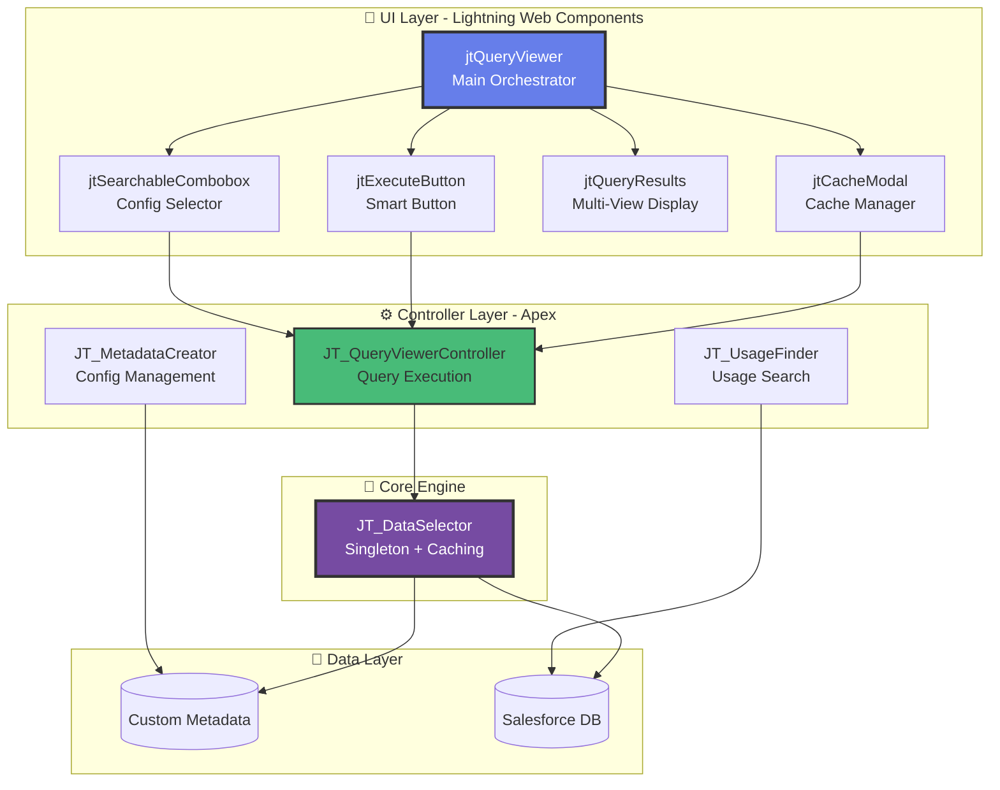

# Dynamic Query Framework for Salesforce ⚡

A metadata-driven SOQL execution framework with built-in security, batch processing, and risk assessment. Stop writing boilerplate query code - configure once, execute anywhere.

> **Framework Philosophy:** Provide infrastructure and conventions for configurable queries, not just isolated utilities.

<a href="https://githubsfdeploy.herokuapp.com?owner=jterrats&repo=JT_DynamicQueries&ref=main">
  
</a>

[](./CODE_QUALITY_REPORT.md)
[](./COVERAGE_REPORT.txt)
[](https://developer.salesforce.com/)
[](./tests/e2e/)
[](./LICENSE)

## 🆕 What's New in v2.0

### 🎨 **Modular Component Architecture**

- Refactored monolithic LWC into **8 specialized components**
- Improved maintainability with clear separation of concerns
- Reusable components for dropdown, inputs, modals, and results

### 🔍 **Enhanced Search & Filtering**

- **Searchable Combobox**: Real-time client-side filtering
- **User Search**: Find and select users instantly (no server round-trips)
- **Configuration Search**: Filter configurations as you type

### 📊 **Advanced Results Viewing**

- **Toggle Views**: Switch between Table, JSON, and CSV formats
- **🆕 Nested Viewer**: Child relationships (Contacts, Opportunities, Cases) with expand/collapse
- **🆕 CSV Preview**: Preview CSV before downloading
- **🆕 Clipboard Support**: Copy JSON/CSV with Locker Service fallback
- **Mobile Responsive**: Expandable cards for mobile devices
- **Export to CSV**: Flattened export with LEFT JOIN style (parent duplication)
- **Syntax Highlighting**: JSON view with formatted, readable output

### 🔐 **Tooling API Integration**

- **"Where is this used?" for Flows**: Search Flow metadata (1-5 API calls)
- **🆕 Smart Deploy**: Auto-detects org URL changes for Named Credentials
- **🆕 Multi-Org Support**: One codebase works across dev/sandbox/production
- **Named Credentials**: Secure integration with dynamic URL provisioning
- **Resilient Architecture**: Partial results if one service fails
- **Comprehensive Setup Guides**: Automated scripts + manual fallback

### ♿ **Accessibility & UX**

- **WCAG 2.1 AA Compliant**: Full accessibility support
- **Keyboard Navigation**: Complete keyboard-only operation
- **Screen Reader Support**: Proper ARIA labels and live regions
- **Tooltips**: Contextual help throughout the interface
- **Error Boundaries**: Component failures don't crash the app

### 🧪 **Testing Excellence**

- **🆕 Bug Fix Validation**: 6 critical bugs fixed with E2E test coverage
- **100% E2E Pass Rate**: 113+ Playwright tests covering all features
- **98% Apex Pass Rate**: 723 unit tests
- **🆕 Automated CI/CD**: GitHub Actions for E2E tests on every merge to main
- **Visual Validation**: Automated screenshots and videos for UI changes

---

## ✨ Features

### 🔧 Core Functionality

- **Metadata-Driven Queries** - Define SOQL queries in Custom Metadata for easy management
- **Dynamic Parameters** - Auto-generates input fields for bind variables with tooltips
- **Query Preview** - See the query before execution with syntax validation
- **Results Pagination** - Client-side pagination for 10+ records
- **Empty State Handling** - Shows table structure even with 0 results
- **🆕 Toggle Views** - Switch between Table, JSON, and CSV formats
- **🆕 Nested Viewer** - Child relationships with expand/collapse (accordion + mini-tables)
- **🆕 CSV Preview** - Preview before download with Copy button (Clipboard API + fallback)
- **🆕 Export to CSV** - Download query results for analysis (flattened with parent duplication)
- **🆕 Mobile Responsive** - Expandable cards on mobile devices
- **🆕 Searchable Dropdowns** - Real-time filtering for configs and users

### 🔒 Security & Permissions

- **USER_MODE Enforcement** - Respects FLS, CRUD, and sharing rules
- **Run As User** - Test queries in another user's permission context (2 modes)
- **Permission Validation** - Requires appropriate permissions for advanced features
- **Production Safeguard** - Metadata creation disabled in production orgs

### 👤 Advanced Run As Feature

- **Standard Mode** - USER_MODE execution with permission validation
- **System.runAs Mode** - True impersonation using Apex test context
- **User Dropdown** - Client-side filtered dropdown with all active users
- **Results Comparison** - See exactly what another user would see

### 🎨 Modern UI/UX (v2.0 Enhanced)

- **Modular Components** - 8 specialized, reusable components
- **Searchable Dropdowns** - Real-time client-side filtering
- **Toggle Result Views** - Table, JSON, or CSV formats
- **Mobile-First Design** - Expandable cards for mobile, tables for desktop
- **Multi-Language Support** - 2 languages (EN, ES) with extensible i18n framework
- **Responsive Design** - Optimized for all screen sizes
- **Dark Theme Compatible** - Works with all Salesforce themes
- **Loading Indicators** - Clear feedback for all async operations
- **Error Boundaries** - Graceful degradation when components fail

### 📚 Built-in Documentation

- **In-App Documentation** - Complete docs accessible within the app
- **Multi-Language Docs** - Documentation in 4 languages
- **API Reference** - Complete Apex and LWC API documentation
- **Troubleshooting Guide** - Common issues and solutions

### 🛠️ Developer Experience (v2.0 Enhanced)

- **Metadata Creation UI** - Create/edit configurations in sandbox with live preview
- **SOQL Validation** - Real-time query validation with helpful error messages
- **Auto-Refresh** - Configuration list updates after creation (no page reload)
- **Usage Finder** - "Where is this used?" shows:
  - Apex class references (line numbers)
  - Flow references (via Tooling API)
  - Resilient microservices pattern (partial results on errors)
- **Invocable Methods** - Use queries in Flows and Agentforce Actions
- **Named Credentials** - Secure Tooling API integration with OAuth 2.0
- **Comprehensive Testing** -
  - Apex: 98% pass rate (723 tests)
  - E2E: 100% pass rate (28 Playwright tests)
- **Audit Trail** - Track all production editing and usage search changes
- **Export Results** - CSV download for external analysis

---

## 🧩 Framework Architecture (v2.0)

### Lightning Web Components (UI Layer)

| Component                | Purpose              | Reusable | Key Features                                     |
| ------------------------ | -------------------- | -------- | ------------------------------------------------ |
| **jtQueryViewer**        | Main orchestrator    | No       | Orchestrates all components, error boundaries    |
| **jtSearchableCombobox** | Generic dropdown     | ✅ Yes   | Client-side filtering, keyboard navigation, ARIA |
| **jtParameterInputs**    | Dynamic inputs       | Partial  | Auto-generates from SOQL, tooltips               |
| **jtExecuteButton**      | Query trigger        | ✅ Yes   | State-driven disabled logic, loading states      |
| **jtConfigModal**        | Create/Edit configs  | No       | SOQL validation, query preview, Tooling API      |
| **jtUsageModal**         | Usage search results | No       | Apex + Flow results, resilient display           |
| **jtQueryResults**       | Results viewer       | ✅ Yes   | Table/JSON/CSV toggle, mobile cards, export      |
| **jtRunAsSection**       | User impersonation   | No       | User search, System.runAs() test execution       |
| **jtProjectDocs**        | Documentation        | No       | Multi-language docs, responsive grid             |
| **jtSupport**            | GitHub issues link   | ✅ Yes   | Localized support page                           |

### Apex Classes

| Class                               | Purpose             | Key Features                                 |
| ----------------------------------- | ------------------- | -------------------------------------------- |
| **JT_DataSelector**                 | Query execution     | Singleton, cache, InvocableMethod, USER_MODE |
| **JT_UsageFinder**                  | Find config usage   | Microservices pattern, Apex + Flow search    |
| **JT_MetadataCreator**              | Deploy metadata     | Tooling API integration, async deployment    |
| **JT_QueryViewerController**        | LWC backend         | Config management, environment detection     |
| **JT_RunAsTestExecutor**            | User impersonation  | System.runAs() in test context, JSON results |
| **JT_ProductionSettingsController** | Settings management | Audit logging, without sharing insertion     |

---

## 🚀 Quick Start

### 1. Deploy to Your Org

#### Option A: Using Salesforce CLI

```bash
git clone https://github.com/jterrats/JT_DynamicQueries.git
cd JT_DynamicQueries
sf project deploy start --target-org your-org-alias
```

#### Option B: One-Click Deploy

<a href="https://githubsfdeploy.herokuapp.com?owner=jterrats&repo=JT_DynamicQueries&ref=main">
  
</a>

### 2. Assign Permission Set

```bash
sf org assign permset --name JT_Dynamic_Queries
```

Or use the Apex script:

```bash
sf apex run --file scripts/apex/assign-permset.apex
```

### 3. Access the App

Navigate to **App Launcher** → **Dynamic Queries**

The app includes five tabs:

- **🔍 Query Viewer** - Execute and manage queries (main interface)
- **📚 Documentation** - Complete in-app documentation (8 languages)
- **📊 Audit History** - Track production editing setting changes (read-only)
- **🆘 Support** - GitHub issues and community support links
- **📈 Reports** - (Future) Access standard reporting functionality

### 4. (Optional) Configure Tooling API

To enable advanced features like **"Where is this used?"** (search in Flows), configure Named Credentials for Tooling API access.

**🚀 Quick Setup (Automated - Recommended):**

```bash
# Auto-detect org URL and deploy Named Credential
./scripts/smart-deploy.sh
```

**💡 Multi-Org Support:**

```bash
# Switch to different org
sf config set target-org my-sandbox

# Smart deploy auto-detects change!
./scripts/smart-deploy.sh
# ⚠️ Org URL mismatch detected!
# 🔄 Updating environment...
# ✅ Named Credential deployed with new org URL!
```

**📚 Detailed Guides:**
- [Named Credential Setup](./scripts/SETUP_NAMED_CREDENTIAL.md) - Automation guide
- [Multi-Org Workflow](./scripts/WORKFLOW_EXAMPLE.md) - Dev/Sandbox/Production examples
- [Scripts README](./scripts/README.md) - All available scripts and aliases

**Note:** The framework works WITHOUT Tooling API (core query execution features remain fully functional). Tooling API is only required for:

- Searching configuration references in Flows

## 📖 Documentation

### In-App Documentation

Complete documentation is available within the app in the **Documentation** tab, including:

- Overview and features
- Step-by-step usage guide
- Configuration examples
- Security model
- Troubleshooting
- API reference

Documentation automatically displays in your browser's language (English or Spanish). Additional languages can be added via the extensible i18n framework.

### External Documentation

- [**Named Credential Setup**](./scripts/SETUP_NAMED_CREDENTIAL.md) - Auto-config for Tooling API with smart-deploy
- [**CI/CD Setup**](./.github/CI_SETUP.md) - GitHub Actions for automated E2E testing
- [**Bug Fixes Summary**](./.github/BUG_FIXES_SUMMARY.md) - 6 critical bugs fixed with test validation
- [Run As User Feature](./RUN_AS_USER_FEATURE.md) - Detailed explanation of Run As modes
- [E2E Testing Guide](./tests/e2e/README.md) - Playwright E2E test documentation
- [Code Quality Report](./CODE_QUALITY_REPORT.md) - PMD and ESLint analysis
- [AppExchange Readiness](./APPEXCHANGE_READINESS.md) - Security review checklist

## 🏗️ Architecture

### 📊 Visual Architecture Diagrams

> 🎨 **Interactive Diagrams**: View beautiful, interactive Mermaid diagrams on our [Architecture Diagrams Page](https://jterrats.github.io/JT_DynamicQueries/architecture/diagrams.html)

### Quick Overview



### 📚 Detailed Architecture Documentation

For comprehensive architecture details including:

- 🔄 Query execution flow diagrams
- 🛡️ Security architecture with USER_MODE
- 🔍 Microservices pattern (Usage Finder)
- 💾 Cache strategy (4 layers)
- 🌐 i18n architecture
- 📱 Responsive design strategy
- 🧪 Testing pyramid

**👉 See:** [Complete Architecture Diagrams](https://jterrats.github.io/JT_DynamicQueries/architecture/diagrams.html)

## 📦 Components

### Custom Metadata Type: `JT_DynamicQueryConfiguration__mdt`

| Field                  | Type      | Description                     | Required |
| ---------------------- | --------- | ------------------------------- | -------- |
| **Label**              | Text      | Display name in the UI          | Yes      |
| **DeveloperName**      | Text      | API name for the configuration  | Yes      |
| **JT_BaseQuery\_\_c**  | Long Text | SOQL query with bind variables  | Yes      |
| **JT_Bindings\_\_c**   | Long Text | JSON object with default values | No       |
| **JT_ObjectName\_\_c** | Text      | Primary object being queried    | No       |

### Apex Classes

#### Core Classes

- **`JT_DataSelector`** - Query execution engine with static cache pattern (Custom Metadata cached per transaction, singleton instance managed internally)
- **`JT_QueryViewerController`** - LWC backend controller with configuration management and parameter extraction
- **`JT_MetadataCreator`** - Handles metadata creation/update and validation (sandbox/scratch org only)
- **`JT_RunAsTestExecutor`** - Orchestrates System.runAs test execution with Platform Cache
- **`JT_GenericRunAsTest`** - Pre-compiled test class for true user impersonation

#### Test Classes

- **`JT_DataSelector_Test`** - Comprehensive tests for query execution
- **`JT_QueryViewerController_Test`** - Controller tests
- **`JT_MetadataCreator_Test`** - Metadata operations tests
- **`JT_RunAsTestExecutor_Test`** - Run As functionality tests
- **`JT_ToolingAPIMock`** - HTTP callout mock for Tooling API

### Lightning Web Components

#### `jtQueryViewer`

Main component for query execution with features:

- Configuration selection dropdown
- Dynamic parameter generation
- Query preview
- Execute query button
- Results datatable with pagination
- Run As user selection (admin only)
- Create/edit configuration modal (sandbox only)
- Multi-language support (EN, ES)

#### `jtProjectDocs`

Documentation component with:

- 9 comprehensive sections
- Multi-language content
- Sticky navigation with table of contents
- Smooth scrolling
- Responsive design
- Code examples and API reference

## 💻 Usage Examples

### Example 1: Simple Query Configuration

```yaml
Label: All Active Accounts
Developer Name: All_Active_Accounts
Base Query: SELECT Id, Name, Industry, AnnualRevenue FROM Account WHERE IsActive__c = true
Bindings: (leave empty)
Object Name: Account
```

### Example 2: Query with Parameters

```yaml
Label: Account Contacts
Developer Name: Account_Contacts
Base Query: SELECT Id, Name, Email, Phone FROM Contact WHERE AccountId = :accountId
Bindings: { "accountId": "0015g00000XXXXXX" }
Object Name: Contact
```

### Example 3: Multiple Parameters

```yaml
Label: Opportunities by Stage and Amount
Developer Name: Opportunities_Stage_Amount
Base Query: SELECT Id, Name, Amount, StageName FROM Opportunity WHERE StageName = :stage AND Amount >= :minAmount
Bindings: { "stage": "Closed Won", "minAmount": 100000 }
Object Name: Opportunity
```

### Programmatic Usage

```apex
// Using predefined bindings from metadata
List<SObject> records = JT_DataSelector.getRecords('All_Active_Accounts');

// Using custom bindings
Map<String, Object> bindings = new Map<String, Object>{
    'accountId' => '0015g00000XXXXXX'
};
List<SObject> contacts = JT_DataSelector.getRecords('Account_Contacts', bindings);

// With access level control
List<SObject> records = JT_DataSelector.getRecords('ConfigName', bindings, AccessLevel.USER_MODE);
```

## 🧪 Testing

### Apex Tests

Run all local tests:

```bash
sf apex run test --test-level RunLocalTests --result-format human
```

Generate coverage report:

```bash
sf apex run test --test-level RunLocalTests --code-coverage --result-format human > COVERAGE_REPORT.txt
```

**Current Coverage**: 84.5% (exceeds 75% requirement)

### E2E Tests with Playwright

#### Install Dependencies

```bash
npm install
npx playwright install chromium
```

#### Run Tests

```bash
# Run all E2E tests
npm run test:e2e

# Run with UI mode (headed)
npx playwright test --headed

# Run specific test file
npx playwright test tests/e2e/queryViewer.spec.js

# Run with debug mode
npx playwright test --debug
```

#### Test Scenarios Covered

1. Component loading and visibility
2. Configuration selection
3. Query execution and results display
4. Dynamic parameter handling
5. Run As user functionality
6. Metadata creation (sandbox only)
7. Production safeguards
8. Pagination controls
9. Empty state handling
10. i18n label verification

See [E2E Testing Documentation](./tests/e2e/README.md) for detailed information.

### Code Quality

Run PMD and ESLint scans:

```bash
# PMD scan for Apex
sf scanner run --format csv --target "force-app/main/default/classes/*.cls" --outfile code-quality.csv

# ESLint for LWC
npm run lint
```

**Current Status**:

- ✅ 0 PMD violations
- ✅ 0 ESLint errors
- ✅ All ApexDoc comments present
- ✅ No hardcoded IDs in production code

## 🔐 Security Model

### Permission Requirements

#### For All Users

- **Permission Set**: `JT_Dynamic_Queries`
  - Grants access to Apex classes
  - Grants access to custom metadata
  - Grants access to the application

#### For Run As Feature

- **View All Data** OR **Modify All Data** permission
  - Required to search and select users
  - Required to execute queries as other users

### Security Features

1. **USER_MODE Enforcement**
   - All queries execute with `WITH USER_MODE`
   - Respects FLS, CRUD, and sharing rules
   - Cannot bypass user permissions

2. **Production Safeguards**
   - Metadata creation UI hidden in production
   - Detection via `Organization.IsSandbox` and `TrialExpirationDate`
   - Forces use of Setup UI for production changes

3. **Input Validation**
   - SOQL queries validated before execution
   - JSON bindings validated
   - Parameter types checked

4. **Run As Validation**
   - Requires admin-level permissions
   - Current user excluded from selection
   - Results reflect target user's actual permissions

## 🌍 Internationalization

The application supports 4 languages with automatic detection:

| Language | Code | Coverage |
| -------- | ---- | -------- |
| English  | en   | 100%     |
| Spanish  | es   | 100%     |
| French   | fr   | 100%     |
| German   | de   | 100%     |

Language is detected from the browser's locale and falls back to English if not supported.

### Translated Components

- All LWC labels and messages
- Button text and tooltips
- Error messages
- Documentation content
- Pagination controls

## 🚀 Performance Optimizations

### Static Configuration Cache

```apex
private static Map<String, JT_DynamicQueryConfiguration__mdt> configCache;
```

- **Custom Metadata cached per transaction** (no repeated SOQL queries)
- Cache persists across method calls within same execution context
- Significantly reduces SOQL consumption (from N queries to 1)
- Improves response time for repeated configuration access

**Pattern Used:** Static factory method with internal singleton instance

- Public methods are `static` for easy access: `JT_DataSelector.getRecords()`
- Internally uses singleton pattern: `getInstance()` maintains instance state
- Best of both worlds: simple API + efficient caching

### Single JSON Deserialization

- Bindings deserialized **once per execution** (not per field access)
- Reduced CPU time and memory allocation
- Better memory management
- Avoids redundant parsing operations

### Efficient Query Execution

- Uses `Database.queryWithBinds()` for **parameterized queries**
- **Prevents SOQL injection** attacks
- Optimized for large result sets
- Enforces `USER_MODE` or `SYSTEM_MODE` as specified

### Client-Side Filtering & Pagination

- User dropdown loaded **once** (cacheable=true)
- Filtered in JavaScript (no repeated Apex calls)
- Pagination handled **client-side** (10 records per page)
- Reduces server round-trips and improves UX

## 📋 Requirements

- Salesforce API v65.0 or higher
- Lightning Experience enabled
- Custom Metadata Types enabled
- Platform Cache enabled (for Run As System.runAs mode)

### Optional for Development

- Node.js 18+ (for E2E tests)
- Playwright (for E2E tests)
- Salesforce CLI (for deployment)

## 🤝 Contributing

Contributions are welcome! Please follow these steps:

1. Fork the repository
2. Create a feature branch (`git checkout -b feature/amazing-feature`)
3. Make your changes
4. Write/update tests (maintain >75% coverage)
5. Run code quality scans
6. Commit your changes (`git commit -m 'Add amazing feature'`)
7. Push to the branch (`git push origin feature/amazing-feature`)
8. Open a Pull Request

### Development Guidelines

- Follow Salesforce best practices
- Add ApexDoc comments to all public methods
- Write comprehensive test classes
- Update documentation for new features
- Ensure all tests pass before submitting PR

## 📄 License

This project is licensed under the MIT License - see the [LICENSE](./LICENSE) file for details.

## 🙏 Acknowledgments

- Salesforce Developer Community
- Lightning Web Components documentation
- PMD and ESLint teams
- Playwright testing framework

## 📞 Support

- **Issues**: [GitHub Issues](https://github.com/jterrats/JT_DynamicQueries/issues)
- **Documentation**: Available in-app or in `/docs` folder
- **Questions**: Open a GitHub Discussion

## 🗺️ Roadmap

### ✅ Completed in v2.0

- Export results to CSV
- Query configuration UI (Create/Edit via modal)
- Multi-language support (2 languages: EN, ES)
- Advanced filtering (Searchable dropdown)
- Cache management

### 🎯 Planned for v3.0

**[📋 View Full v3.0 Roadmap](https://jterrats.github.io/JT_DynamicQueries/V3_ROADMAP.html)** | **[🎫 18 GitHub Issues Created](https://github.com/jterrats/JT_DynamicQueries/issues)**

- Visual SOQL Builder (Drag & drop field selector)
- Query history and favorites
- Bulk query execution (multiple configs at once)
- Advanced result filtering (column filters, search)
- Query templates library
- Real-time query validation (as you type)
- Performance analytics dashboard
- Additional language support (extensible i18n framework for future languages)

### 💡 Future Considerations

- GraphQL support
- Scheduled query execution
- Result comparison tool
- Query optimization suggestions (AI-powered)
- Integration with External Objects
- Advanced Agentforce actions
- Security enhancements suite

---

<div align="center">

<a href="https://githubsfdeploy.herokuapp.com?owner=jterrats&repo=JT_DynamicQueries&ref=main">
  
</a>

</div>
