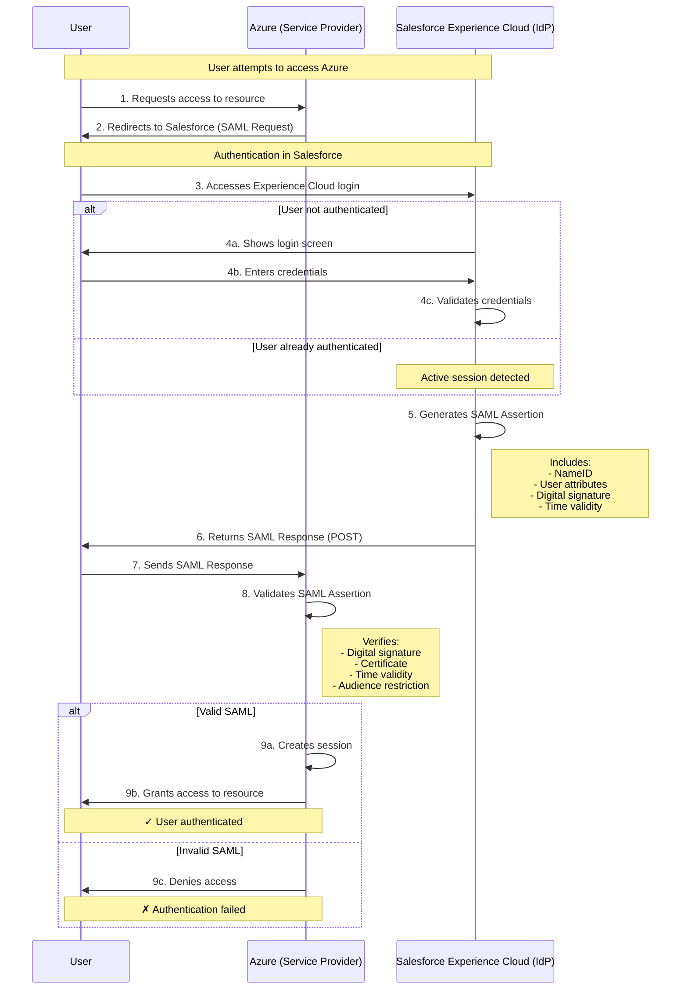
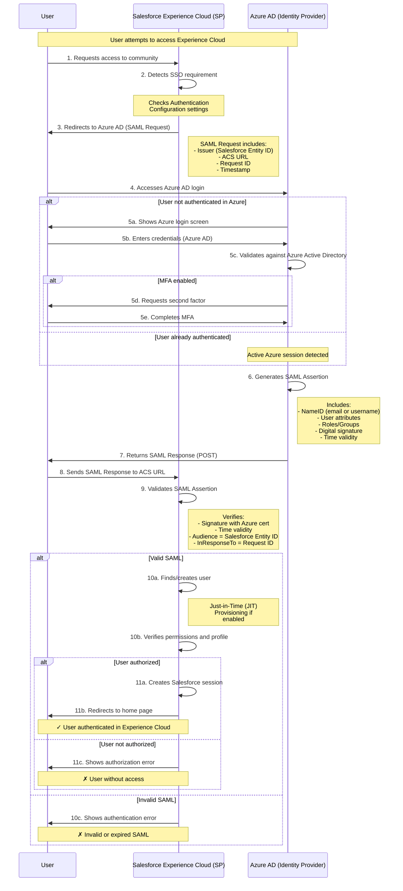

# SSO Flows with Salesforce and Azure

This document explains the two main SSO (Single Sign-On) flows with Salesforce Experience Cloud and Azure.

## 1. Salesforce as Identity Provider (IdP)

In this scenario, Salesforce acts as the identity provider that authenticates users for external applications (such as Azure).

### Required Configuration in Salesforce (IdP):

1. **Connected App in Salesforce:**
   - Enable SAML
   - Configure Azure ACS URL
   - Define Entity ID
   - Configure SAML attributes to send

2. **Experience Cloud:**
   - Configure users and profiles
   - Enable SSO for external users
   - Define session policies

3. **Certificates:**
   - Generate self-signed certificate in Salesforce
   - Share public certificate with Azure

### Required Configuration in Azure (SP):

1. **Enterprise Application:**
   - Register Salesforce as IdP
   - Configure Single Sign-On with SAML
   - Import Salesforce public certificate
   - Map user attributes

---

## 2. Salesforce Experience Cloud as Service Provider (SP)

In this scenario, Salesforce Experience Cloud trusts Azure AD as the identity provider to authenticate users.

### Required Configuration in Azure AD (IdP):

1. **Enterprise Application:**
   - Create new enterprise application
   - Configure SAML-based Sign-On
   - Configure Salesforce URLs:
     - Entity ID (Audience)
     - ACS URL (Reply URL)
   - Define attributes and claims to send
   - Assign users and groups

2. **Certificates:**
   - Generate certificate in Azure
   - Download public certificate (Base64)
   - Configure SAML signing

3. **Conditional Access (optional):**
   - Configure access policies
   - MFA requirements
   - Location-based access

### Required Configuration in Salesforce Experience Cloud (SP):

1. **Single Sign-On Settings:**
   - Create new SAML configuration
   - Import Azure metadata XML or configure manually:
     - Azure Entity ID
     - Azure Login URL
     - Azure Logout URL
   - Upload Azure public certificate
   - Configure User ID Location (NameID)
   - Select User ID Type (email, username, etc.)

2. **Authentication Configuration:**
   - Create new authentication configuration
   - Associate SSO Settings
   - Define as default authentication method

3. **Experience Cloud Configuration:**
   - In Experience Workspaces > Administration
   - Login & Registration > Authentication Configuration
   - Select created configuration
   - Enable Self-Registration (optional for JIT)

4. **Just-in-Time (JIT) Provisioning (optional):**
   - Configure SAML JIT Handler (Apex)
   - Define SAML attribute mapping to Salesforce fields
   - Configure default profile
   - Configure Account assignment

5. **Domain Configuration:**
   - My Domain must be enabled
   - Configure Authentication Configuration on domain

---

## Flow Comparison

| Aspect                     | Salesforce as IdP                      | Salesforce as SP                       |
| -------------------------- | -------------------------------------- | -------------------------------------- |
| **Identity provider**      | Salesforce                             | Azure AD                               |
| **User management**        | In Salesforce                          | In Azure AD                            |
| **Credentials**            | Salesforce database                    | Active Directory                       |
| **MFA**                    | Salesforce MFA                         | Azure MFA                              |
| **Provisioning**           | Manual or API                          | JIT or SCIM                            |
| **Use case**               | Employees access Azure from Salesforce | External users access Experience Cloud |
| **Certificate complexity** | Salesforce generates, Azure imports    | Azure generates, Salesforce imports    |

---

## Best Practices

### Security:

- ✓ Use certificates with minimum 2048 bits
- ✓ Rotate certificates regularly (every 1-2 years)
- ✓ Enable MFA in both scenarios
- ✓ Configure appropriate session policies
- ✓ Monitor failed login attempts
- ✓ Use HTTPS for all URLs

### SAML Attributes:

- ✓ Send only necessary attributes
- ✓ Use persistent NameID when possible
- ✓ Map roles/groups for authorization
- ✓ Include email as additional attribute

### Testing:

- ✓ Test with users of different profiles
- ✓ Validate error flow (incorrect credentials)
- ✓ Verify session timeouts
- ✓ Test logout (SLO - Single Logout)
- ✓ Validate in different browsers

### Troubleshooting:

- Debug logs in Salesforce (Setup > Security > Security Health Check)
- SAML Assertion Validator tools
- Network traces (browser developer tools)
- Azure AD Sign-in logs
- Salesforce Login History

---

## References

- [Salesforce SSO Implementation Guide](https://help.salesforce.com/s/articleView?id=sf.sso_about.htm)
- [Azure AD SAML SSO](https://learn.microsoft.com/en-us/azure/active-directory/manage-apps/what-is-single-sign-on)
- [Experience Cloud External Identity](https://help.salesforce.com/s/articleView?id=sf.networks_external_identity.htm)
