# Architecture Diagrams

## 📊 System Overview

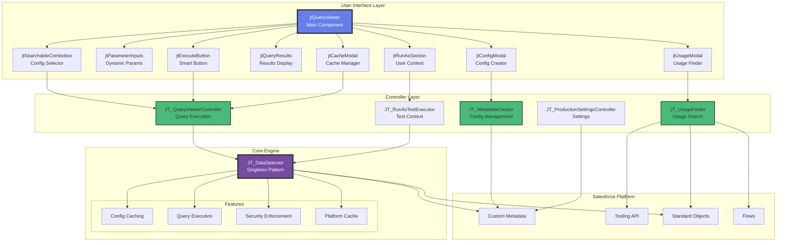

---

## 🔄 Query Execution Flow

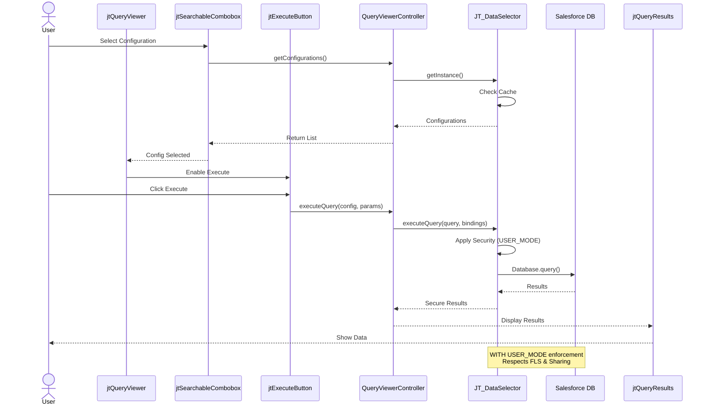

---

## 🏗️ Component Architecture

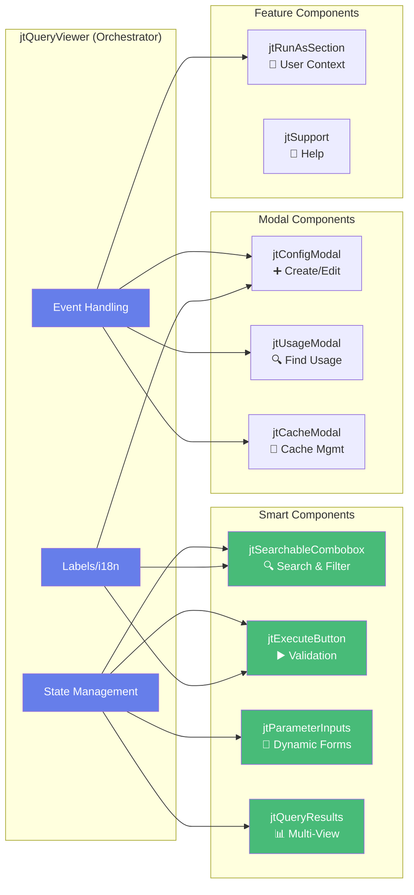

---

## 🛡️ Security Architecture

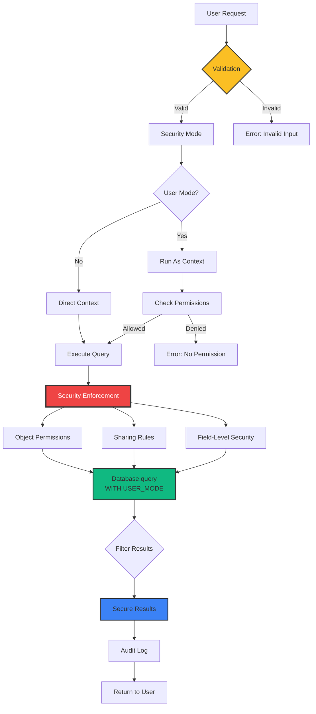

---

## 🔍 Usage Finder (Microservices Pattern)

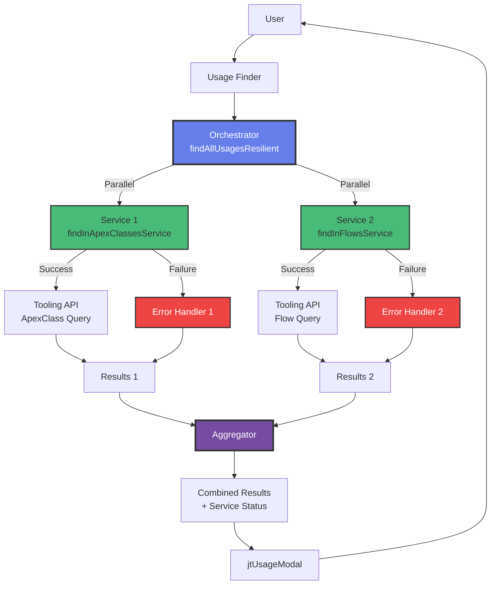

---

## 💾 Cache Strategy

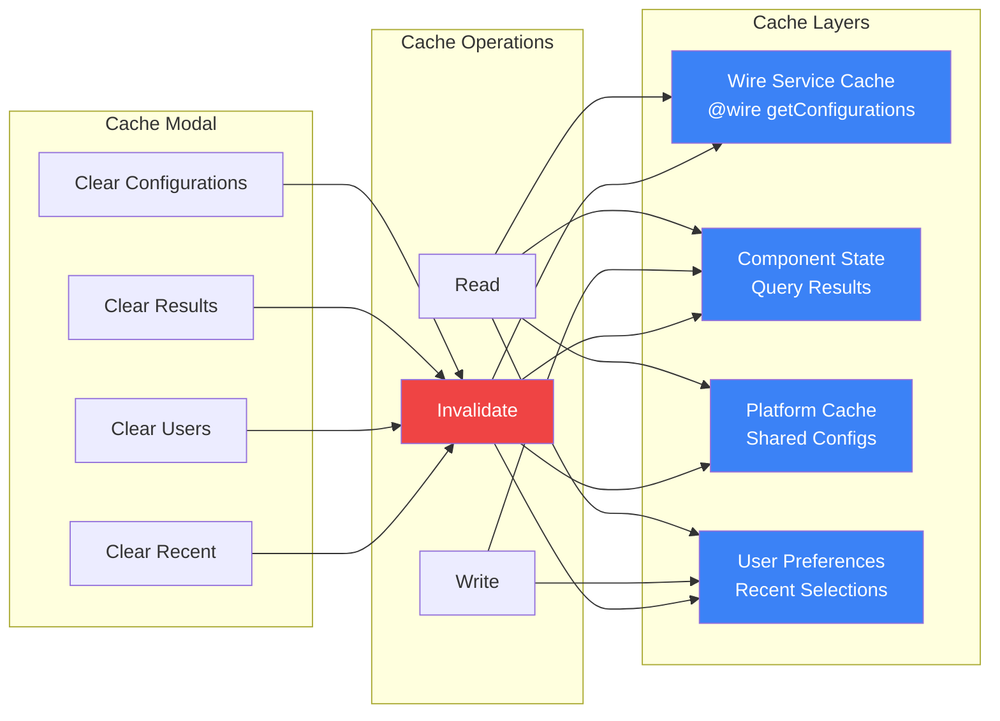

---

## 🌐 i18n Architecture

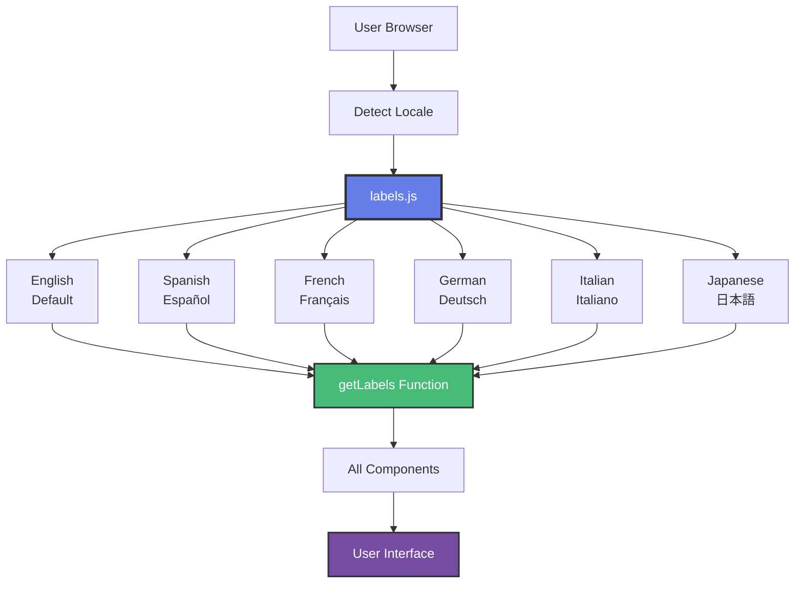

---

## 📱 Responsive Design Strategy

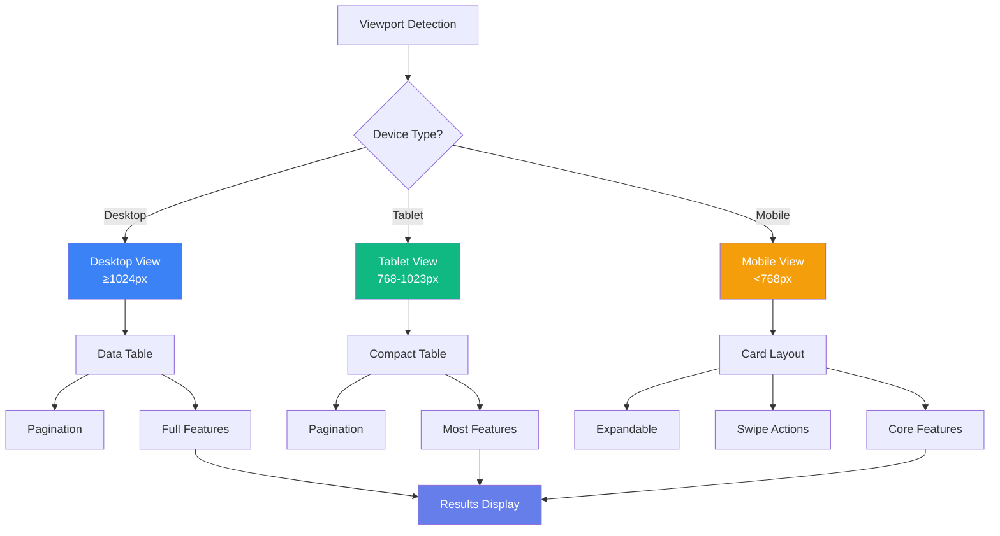

---

## 🧪 Testing Strategy

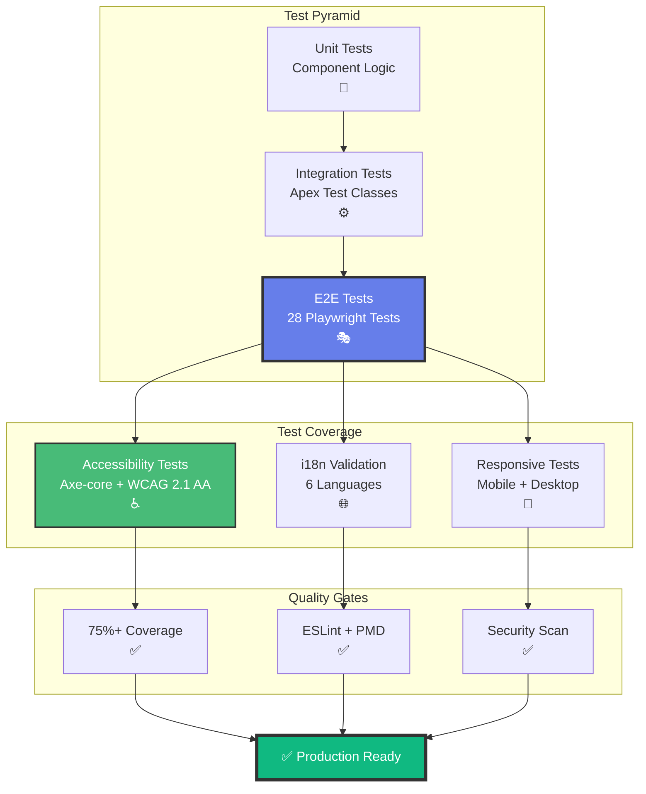

---

## 🚀 Deployment Pipeline

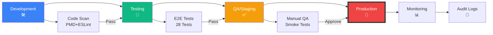

---

## 📊 Data Flow

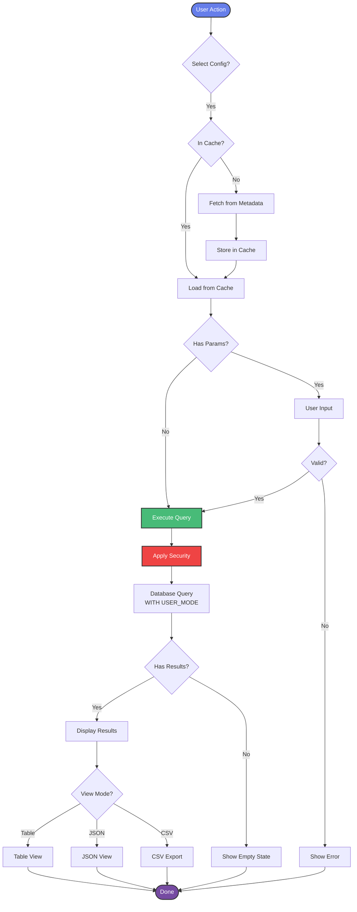

---

## 🎨 Component Hierarchy

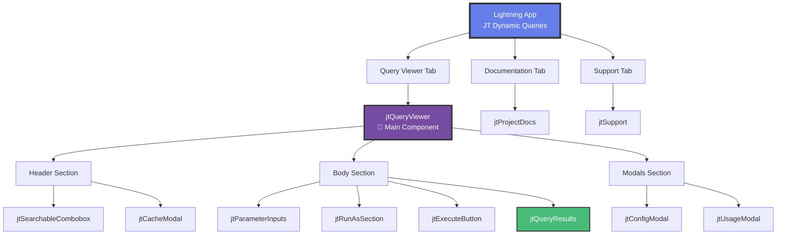

---

## 💡 Key Design Patterns

### Singleton Pattern

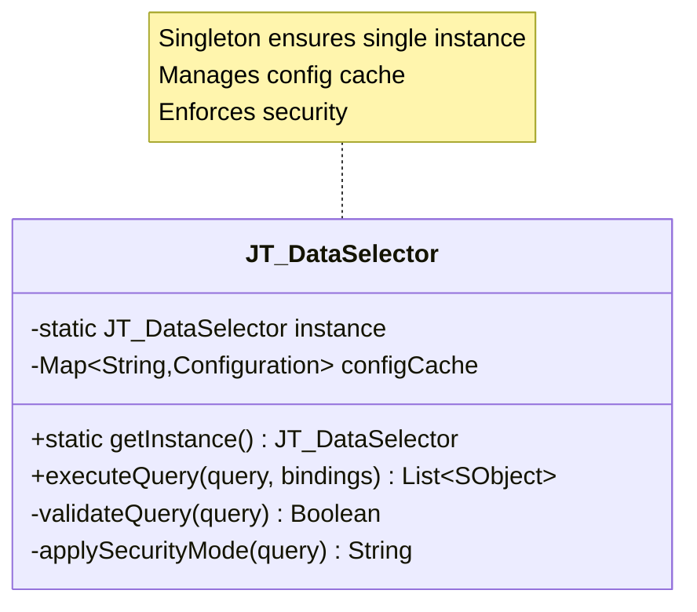

### Observer Pattern

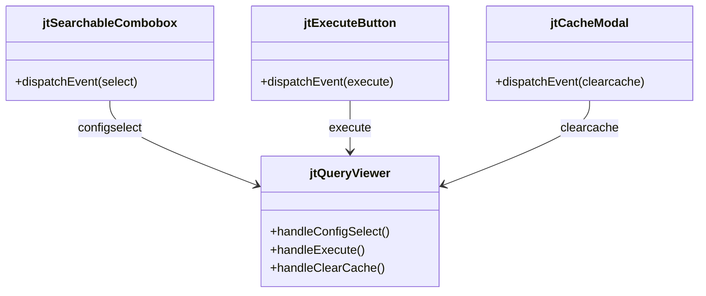

---

## 📈 Performance Metrics

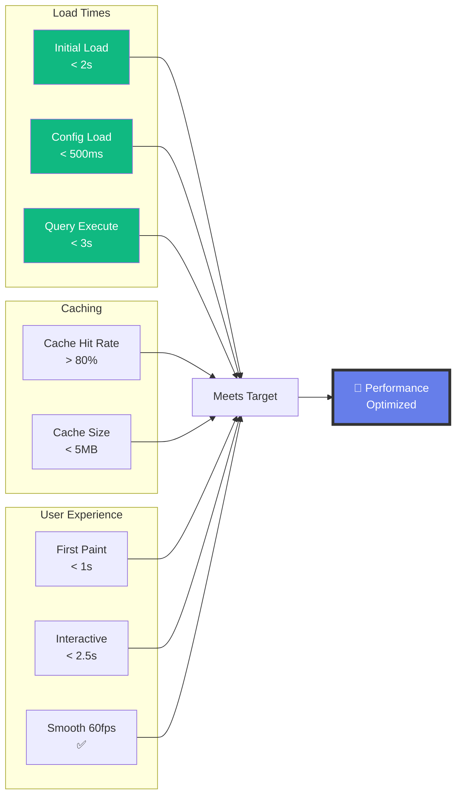

---

> **Note:** All diagrams are interactive on GitHub Pages. View source for Mermaid syntax.

**Last Updated:** {{ site.time | date: '%B %d, %Y' }}
