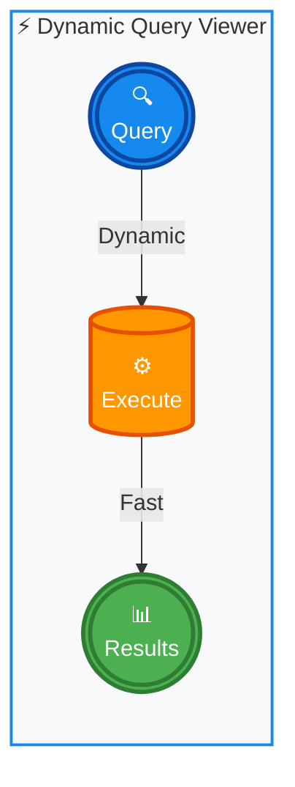
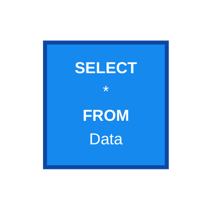
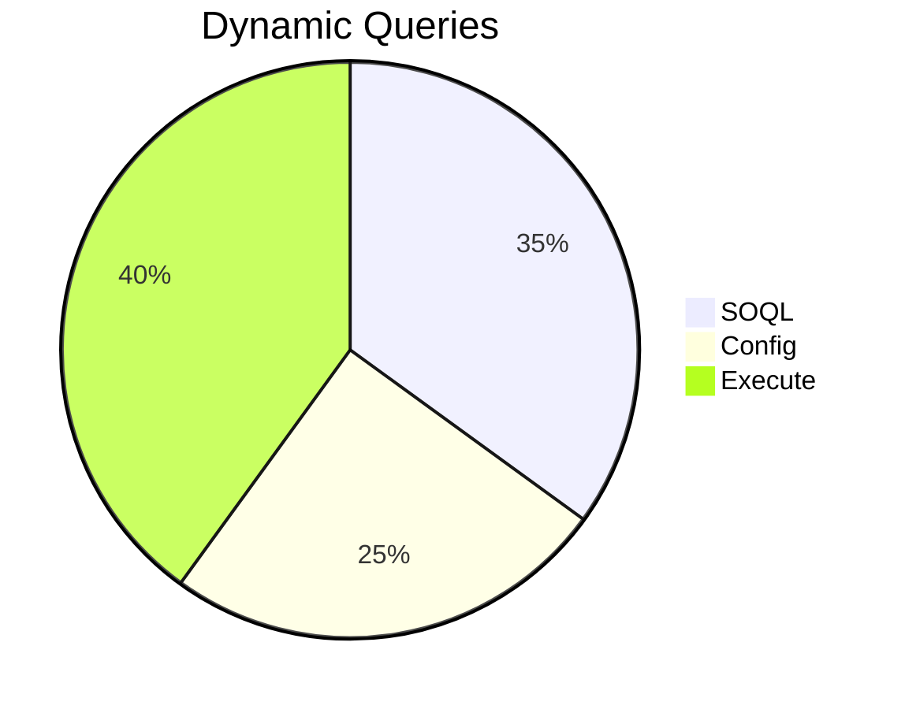
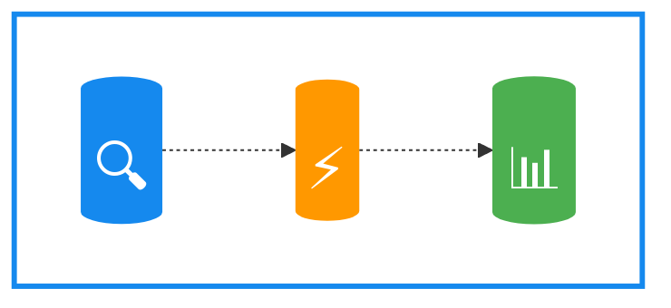
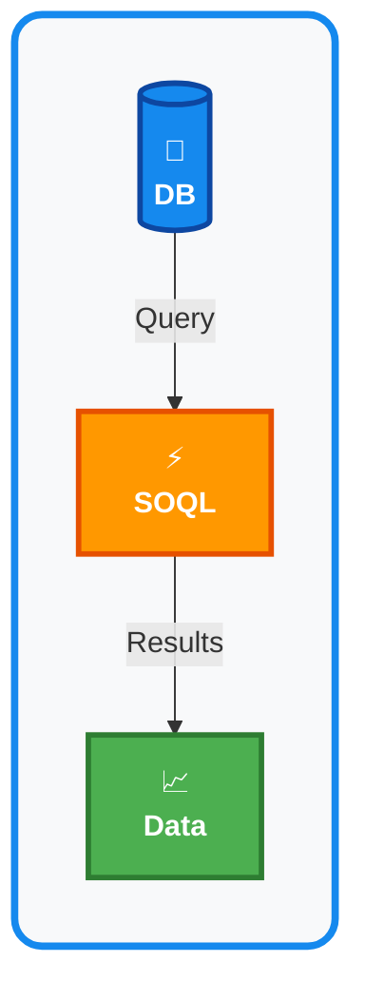

# Dynamic Query Viewer - Logo Concept

## Logo Design (Mermaid)

## Alternative: Icon-Style Logo

## Circular Badge Logo

## Simplified Brand Icon

---

## Color Palette

- **Primary Blue**: `#1589EE` (Lightning Blue)
- **Action Orange**: `#FF9800` (Execute/Dynamic)
- **Success Green**: `#4CAF50` (Results/Data)
- **Dark Blue**: `#0D47A1` (Borders)

## Logo Characteristics

✅ **Simple**: 3 elements (Search → Execute → Results)
✅ **Memorable**: Circular flow representing queries
✅ **Colorful**: Uses brand colors (Blue, Orange, Green)
✅ **Scalable**: Works at any size
✅ **Meaningful**: Represents the app's core functionality

## Recommended: Database Query Icon

