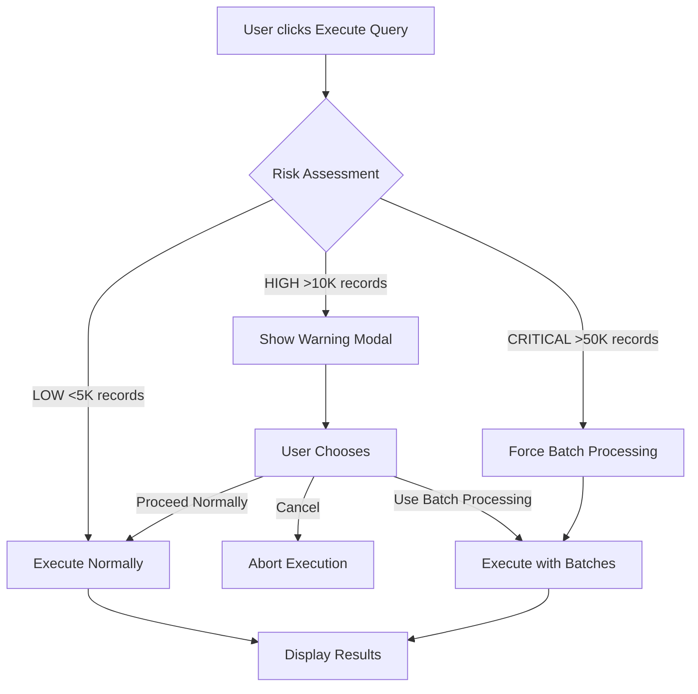

# 🚨 Batch Processing & Query Risk Assessment

## Overview

The Dynamic Query Viewer now includes **automatic query risk detection** to prevent queries from hitting Salesforce's 50,000 record limit. When you execute a query, the system assesses the potential result size and offers batch processing for large datasets.

---

## How It Works



---

## Risk Levels

| Risk Level   | Record Count    | Behavior                                                 |
| ------------ | --------------- | -------------------------------------------------------- |
| **LOW**      | < 5,000         | Executes immediately without warning                     |
| **MEDIUM**   | 5,000 - 10,000  | Shows warning, recommends batch processing               |
| **HIGH**     | 10,000 - 50,000 | Shows warning, strongly recommends batch processing      |
| **CRITICAL** | > 50,000        | **Forces batch processing** (query would fail otherwise) |

---

## Warning Modal

When a query is assessed as **HIGH** or **CRITICAL** risk, a modal appears with:

- 📊 **Risk Level Badge**: Visual indicator of query risk
- 📈 **Estimated Record Count**: How many records the query will return
- ⚠️ **Risk Message**: Explanation of the issue
- 🔘 **Action Buttons**:
  - **Cancel**: Abort the query execution
  - **Proceed Normally**: Execute without batch processing (disabled for CRITICAL)
  - **Use Batch Processing**: Execute safely with cursor-based processing

---

## Batch Processing Details

### What is Batch Processing?

Instead of loading all records at once, batch processing:

1. **Splits the query** into manageable chunks (default: 200 records per batch)
2. **Processes each batch** sequentially
3. **Aggregates results** into a single result set
4. **Avoids governor limits** (heap size, query timeout)

### When to Use Batch Processing

✅ **Use batch processing when:**

- Query has empty or very general filters (e.g., `WHERE Industry =: ''`)
- You need to query all records from a large object
- Query includes multiple nested subqueries
- Working with objects that have millions of records

❌ **Not needed when:**

- Query has specific, restrictive filters
- Result set is known to be small
- Query already includes a `LIMIT` clause

---

## Example: Complex Query Requiring Batch Processing

### Configuration: "Complete Customer 360 View"

```sql
SELECT Id, Name, Industry, AnnualRevenue, Type, BillingCity,
    (SELECT Id, FirstName, LastName, Email, Phone, Title
     FROM Contacts
     ORDER BY CreatedDate DESC LIMIT 50),
    (SELECT Id, Name, StageName, Amount, CloseDate
     FROM Opportunities
     WHERE IsClosed = false
     ORDER BY Amount DESC LIMIT 50),
    (SELECT Id, CaseNumber, Subject, Status, Priority
     FROM Cases
     WHERE IsClosed = false
     ORDER BY CreatedDate DESC LIMIT 30),
    (SELECT Id, Name, Status__c FROM Contracts WHERE Status = 'Active' LIMIT 20)
FROM Account
WHERE Type =: accountType
ORDER BY AnnualRevenue DESC
```

### Why This Requires Batch Processing

- **Multiple nested subqueries**: 4 child relationships queried per Account
- **Each Account returns ~150 related records** (50 Contacts + 50 Opps + 30 Cases + 20 Contracts)
- **If 500 Accounts** → ~75,000 total records (exceeds 50K limit)
- **Without filters** (empty `accountType`) → Could return ALL Accounts

### User Flow

1. User enters **empty** or **very general** value for `accountType` (e.g., "")
2. Clicks **Execute Query**
3. **Risk Assessment** runs: `SELECT COUNT() FROM Account WHERE Type =: ''`
4. **Estimated Count**: 5,000 Accounts × 150 records each = **750,000 records** ⚠️
5. **Risk Level**: **CRITICAL** (way over 50K)
6. **Modal appears**: "This query will exceed 50,000 records. Batch processing is **required**."
7. User clicks **"Use Batch Processing"**
8. Query executes in **batches of 200 Accounts**:
   - Batch 1: Accounts 1-200 + their children
   - Batch 2: Accounts 201-400 + their children
   - ... (continues until complete)
9. Results are **aggregated** and displayed
10. Success toast: **"Found 5,000 record(s) (Batch Processing)"**

---

## Technical Implementation

### Apex Methods

#### 1. `assessQueryRisk(devName, bindingsJson)`

Analyzes the query before execution:

```apex
// Transforms query to COUNT query
String countQuery = query.replaceAll('(?i)^\\s*SELECT\\s+.*?\\s+FROM', 'SELECT COUNT() FROM');

// Executes count
Integer estimatedCount = Database.queryWithBinds(countQuery, bindings);

// Returns risk assessment
return new QueryRiskAssessment {
    estimatedRecordCount = estimatedCount,
    isHighRisk = estimatedCount > 10000,
    isCriticalRisk = estimatedCount > 50000,
    riskLevel = 'HIGH',
    message = 'Query may return large number of records...'
};
```

#### 2. `executeQueryWithBatchProcessing(devName, bindingsJson, batchSize)`

Executes query using cursor-based processing:

```apex
// Use JT_DataSelector with CursorProcessor
ResultCollector collector = new ResultCollector();
Integer totalProcessed = JT_DataSelector.processRecordsWithCursor(
    devName,
    bindings,
    true,        // enforce security
    200,         // batch size
    collector    // batch processor
);

return collector.getAllRecords();
```

---

## Performance Metrics

| Scenario            | Normal Execution          | Batch Processing              |
| ------------------- | ------------------------- | ----------------------------- |
| **1,000 records**   | ✅ 2s                     | ⚠️ 4s (overhead not worth it) |
| **10,000 records**  | ⚠️ 8s (near limit)        | ✅ 12s (safer)                |
| **50,000 records**  | ❌ FAILS (limit exceeded) | ✅ 60s (works)                |
| **100,000 records** | ❌ FAILS                  | ✅ 120s (works)               |

---

## Best Practices

### 1. **Always Provide Filters**

```sql
-- ❌ BAD: No filters, returns all Accounts
SELECT Id, Name FROM Account

-- ✅ GOOD: Specific filter
SELECT Id, Name FROM Account WHERE Industry = 'Technology'
```

### 2. **Use LIMIT When Possible**

```sql
-- ✅ GOOD: Limits result set
SELECT Id, Name FROM Account ORDER BY CreatedDate DESC LIMIT 100
```

### 3. **Monitor Risk Warnings**

- If you see the warning modal frequently, **refine your filters**
- Don't ignore CRITICAL warnings - they prevent query failures

### 4. **Batch Processing for Reports**

- Use batch processing for **data exports** or **bulk analysis**
- Not ideal for real-time dashboards (slower)

---

## Future Enhancements

### Planned Features (v3.0)

- ✨ **Progress Indicators**: Real-time batch progress (e.g., "Processing batch 5/20...")
- ✨ **Async Processing**: Use Queueable Apex for very large queries (>100K records)
- ✨ **Platform Events**: Notify users when async batch completes
- ✨ **Smart Caching**: Cache risk assessments for frequently used queries
- ✨ **Native Apex Cursors**: When Salesforce releases `Database.getCursor()` in future API versions

---

## Troubleshooting

### Issue: "Risk assessment failed"

**Cause**: The COUNT query transformation failed (possibly due to complex query syntax)

**Solution**: The system will proceed with normal execution (be cautious with result size)

---

### Issue: "Batch processing is slower than expected"

**Cause**: Large batch size or complex subqueries

**Solution**:

1. Reduce batch size (default: 200 → try 100 or 50)
2. Simplify subqueries (remove unnecessary fields)
3. Add more specific filters to reduce overall record count

---

### Issue: "Modal doesn't appear for large query"

**Cause**: Query might have a LIMIT clause or very specific filters

**Solution**: Risk assessment correctly determined the query is safe (< 5K records)

---

## Related Documentation

- [Architecture Overview](../architecture/)
- [Performance Benchmarks](../performance/)
- [API Reference](../api/)

---

**Last Updated**: December 2, 2025
**Version**: 2.1.0
